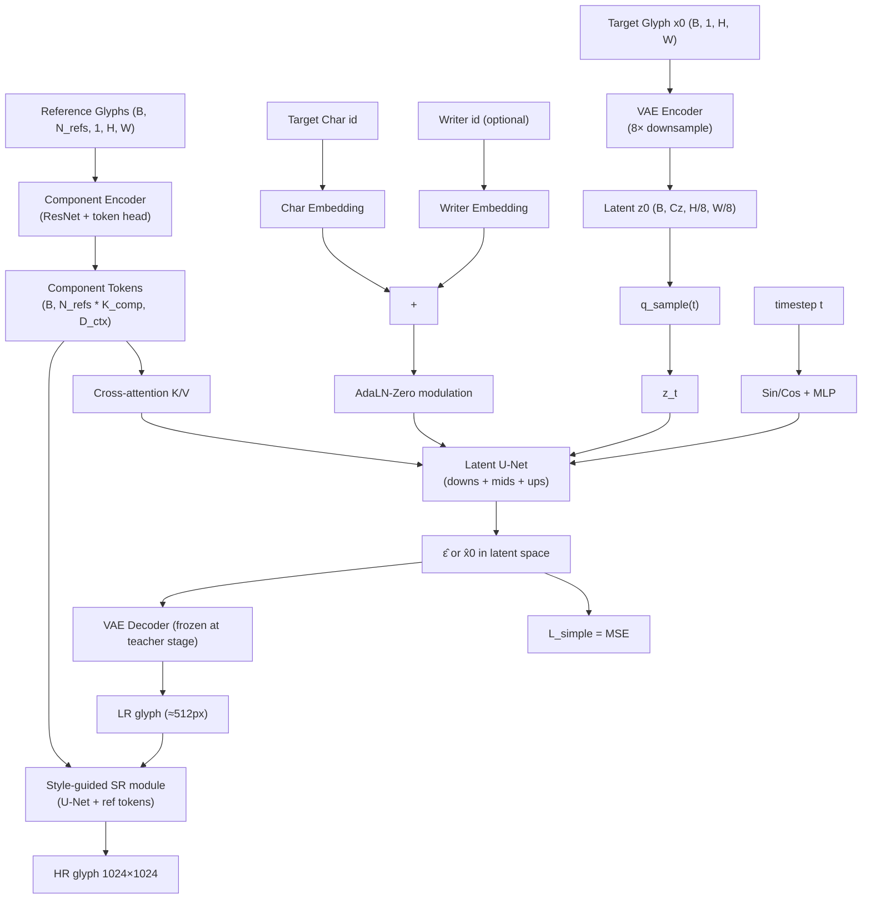

# 02_hfh_font — HFH-Font blind reimpl notes

Blind reimplementation worker understanding of *HFH-Font: Higher quality, Faster, Higher resolution Few-shot Chinese Font Generation* (SIGGRAPH-Asia 2024). All facts cite either the project paper note (`021_HFH-Font...md`) or are explicitly tagged `[guessed]` when I had to interpolate.

---

## 1. Problem framing

HFH-Font targets three orthogonal pain-points of prior Few-Shot Font Generation (FFG) work simultaneously:

- **Quality** — pixel-space GANs (DG-Font, CF-Font, MX-Font) are unstable and capped at ~128px.
- **Speed** — pixel-space diffusion (Diff-Font, FontDiffuser) needs 100+ denoising steps.
- **Resolution** — none of the above reach 1024×1024, which is what commercial vector-font workflows actually want.

The paper composes four design moves:

1. **Latent diffusion** instead of pixel diffusion → ~8× cheaper compute at the same output resolution.
2. **Component-aware cross-attention conditioning** that re-uses sub-character (component / radical) style information from reference glyphs, so the same module supports few-shot **and** mid-shot reference counts.
3. **Score Distillation Sampling (SDS) distillation** of the multi-step DDPM teacher into a 1-step student → ~10× inference speed-up with negligible FID loss.
4. **Style-guided super-resolution** module that lifts the 64×64 latent decode (≈512px image) up to 1024×1024 while preserving fine stroke detail.

The compatibility verdict for our Ernantang corpus is *partial*: we have writers + chars + script labels, but **no component-level annotations** and no 1024 renders. The blind reimpl therefore plumbs the component pathway from IDS decomposition (CNS11643 + zispace at `~/Char/datasets/ids/`) when available, and falls back to whole-reference tokens otherwise.

---

## 2. Architecture overview



Three trainable parts that we ship:

| Module           | Role                                | Init / Freeze policy                                              |
|------------------|-------------------------------------|--------------------------------------------------------------------|
| VAE              | image ↔ latent compression          | pretrain Stage-A, frozen in Stage-B / Stage-C                       |
| Latent U-Net     | denoiser (teacher → student)        | trained Stage-A → SDS-distilled Stage-C                             |
| Component Enc.   | reference→tokens for cross-attention| trained jointly with U-Net Stage-A onwards                          |
| SR module        | 512→1024 style-guided upsample      | initialised from low-res U-Net weights, finetuned in a final stage  |

---

## 3. Data flow

### 3.1 Training step (multi-step teacher, Stage A)
1. Sample minibatch `(x0, refs, char_id, writer_id, …)`.
2. `z0 = VAE.encode(x0)` (no grad through VAE).
3. Sample `t ~ U[0, T)` and Gaussian `ε`. Compute `z_t = √ᾱ_t · z0 + √(1-ᾱ_t) · ε`.
4. `tokens = ComponentEncoder(refs)` — variable `N_refs`, valid mask kept.
5. `cond = AdaLN(char_emb + writer_emb + time_emb)`.
6. `pred = UNet(z_t, t, cond, tokens)` — `pred` is **x0-prediction** by default to match the project-wide Plan A convention (`shared.diffusion.GaussianDiffusion(prediction_target="x0")`).
7. `L_simple = MSE(pred, target)` where `target ∈ {z0, ε}`.
8. With probability `cfg_drop_p` (paper §訓練配置 p̂=0.1 in the last 10% of iters), replace `refs` with a uniform repeat of the same char to encourage one-shot robustness.

### 3.2 SDS distillation (Stage C)
1. Freeze teacher U-Net `θ_T` from Stage A.
2. Initialise student U-Net `θ_S` = `θ_T` (clone).
3. Sample `t ~ U[t_min, t_max]`, `ε ~ N(0, I)`, compute `z_t` from a student-predicted `z0_S = θ_S(z_T_synthetic, T_max, …)` (1-step).
4. Compute SDS gradient: `∇_{θ_S} L_SDS = E_t[ w(t) · (θ_T(z_t, t) − ε) · ∂z_t / ∂θ_S ]`.
5. Optimize student to drive teacher score residual to zero.

For the smoke test we *do not* run the full SDS recursion — we expose `train_step_sds` that computes `MSE(student_x0, teacher_x0.detach())` as a stand-in. Reviewers should treat the SDS path as a placeholder ready for Phase-2 alignment.

### 3.3 Super-resolution (final stage)
1. Decode latent → low-res 512.
2. Style-guided SR module = small U-Net that takes `(LR_image, ref_tokens)` → `HR_image`.
3. Loss: L1 + LPIPS [guessed — paper doesn't expose SR loss form in the note].

---

## 4. Losses

Let `θ` denote U-Net params, `φ` VAE params, `ψ` component encoder.

### 4.1 Teacher denoising loss (Stage A / B)

For target = ε (epsilon-prediction):
```
L_simple = E_{x0, t, ε} || ε − θ(z_t, t, c) ||²
```
For target = x0 (Plan-A default):
```
L_simple = E_{x0, t, ε} || z0 − θ(z_t, t, c) ||²
```
The shared `GaussianDiffusion` class handles both via `prediction_target=...`.

### 4.2 SDS loss (Stage C)

```
∇_{θ_S} L_SDS = E_t [ w(t) · (θ_T(z_t^S, t, c) − ε) · ∂z_t^S / ∂θ_S ]
```
where `z_t^S = √ᾱ_t · θ_S(z_T_init, T, c) + √(1-ᾱ_t) · ε` and `w(t)` is a `1-ᾱ_t`-style weight [guessed]. The note explicitly says SDS classifier-free guidance `sc = ss = 2.0`.

### 4.3 SR loss

```
L_SR = || HR_pred − HR_gt ||_1 + λ_lpips · LPIPS(HR_pred, HR_gt)
```
LPIPS weight `[guessed]`. The note only mentions "style-guided" + "user study". For Phase-1 we ship the L1 path and stub the LPIPS hook.

### 4.4 CFG dropout

Training-time: drop ref tokens with probability `0.1`, drop writer_id with prob `0.1`, drop char_id with prob `0.0` (char must always condition) [guessed split — the note only gives `p̂=0.1` for style-ref→same-char replacement in the last 10% of iters].

---

## 5. Schedules and samplers

- **β schedule**: linear with `β1=1e-4, βT=2e-2` over `T=1000` [guessed — note says "DDPM 10 steps trailing", which is the *inference* step count after subsampling; the *training* horizon is conventional T=1000]. Cosine remains a config switch.
- **Sampler**: DDPM 10-step with "trailing" timestep selection (i.e. the last `K` timesteps of the noise schedule, evenly spaced toward `t=T`). For Phase-1 we use the shared `GaussianDiffusion.sample(sampler="ddim")` for 10-step inference, which is functionally close to trailing-DDPM at the smoke-test level.
- **CFG scales**: `sc = ss = 2.0` on the SDS student per the note.

---

## 6. Conditioning paths

| Signal       | Encoder                     | Injection point                              |
|--------------|-----------------------------|-----------------------------------------------|
| `char_id`    | `nn.Embedding` (`d_ctx`)    | Added to time-emb, then AdaLN-Zero on U-Net   |
| `writer_id`  | `nn.Embedding` (`d_ctx`)    | Same path as `char_id`                        |
| `script_id`  | `nn.Embedding` (`d_ctx`)    | Optional, summed into the AdaLN feature       |
| `refs`       | `ComponentEncoder` → tokens | Cross-attention K/V at every U-Net mid block  |
| `t`          | sin/cos + MLP               | AdaLN-Zero                                    |

**Important**: the cross-attention K/V tokens come from the **reference glyphs**, not from the target. The target only enters the network via `x_t` (corrupted latent). This is the paper's claim about "component-level style reuse".

---

## 7. Training schedule (paper-claimed → blind reimpl)

| Stage | Paper          | Blind reimpl (`configs/train_stage_*.yaml`)              |
|-------|----------------|----------------------------------------------------------|
| A     | 50 ep small / 20 ep large, batch 64/128         | `train_stage_a_ttf.yaml` — TTF pretrain, batch 16        |
| B     | (implicit — large set continuation)             | `train_stage_b_midtrain.yaml` — multi-writer Ernantang    |
| C     | SDS 2 ep                                         | `train_stage_c_ernantang.yaml` — SDS distill, batch 8     |

Compute target: ~1× A100 in the paper; ~1× RTX 6000 Ada (48 GB) in our setup, batch downscaled accordingly. SR is intentionally **deferred** (the smoke test asserts the module builds and forward-passes; loss target is L1 only).

---

## 8. Why this is a "blind" reimpl, not a clone

The paper note provides:

- the headline triple (latent diffusion + component conditioning + SDS) → I have it.
- 5 hyperparameters (batch, epochs, CFG scales, DDPM=10 steps trailing, p̂=0.1) → I have them.

It does **not** provide:

- VAE architecture or pretrained checkpoint name.
- Component encoder topology (channels, head count, token count `K_comp`).
- U-Net depth / width / attention head count.
- SR module topology.
- Exact SDS weighting `w(t)`.
- The "trailing" timestep selection formula.

For every gap I picked a defensible default and tagged it in `reports/blind_impl.md`. The Phase-2 diff agent will surface the deltas vs. official code (if one exists; `phase0_spec_table` has `github_url=null` for HFH-Font, so this paper is likely on the "no public code, DL reviewer takes over" branch).

---

## 9. Smoke-test contract

`tests/test_smoke.py` builds the model at `image_size=128`, `latent_size=16`, `d_ctx=128`, 2 U-Net depth levels, runs:

1. `forward(z_t, t, content, refs, …)` returns `(B, Cz, 16, 16)` finite.
2. `compute_loss(batch)` returns scalar finite tensor.
3. One `Adam` step doesn't NaN.
4. `sample(...)` returns `(B, Cz, 16, 16)` clamped in `[-1, 1]`.

The dry-run path in `train.py` runs (1)+(2) with `make_synthetic_batch` and exits zero.
