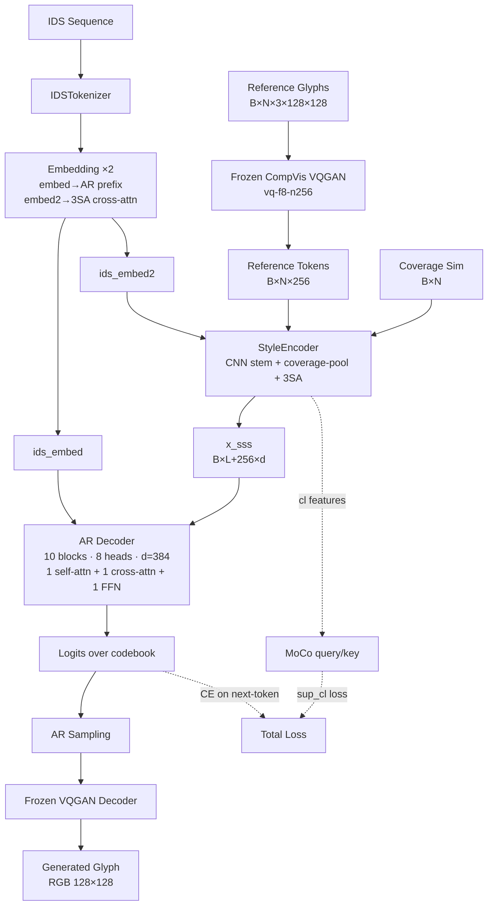

# 03 — IF-Font (NeurIPS 2024)

> **[REVISED PER PHASE 2]** This note has been rewritten after auditing the
> official Stareven233/IF-Font repository (commit `0d8864d9`). The Phase-1
> blind reimplementation, which this note used to describe, contained
> seven P0 architecture deviations (see `reports/github_diff.md`); all are
> corrected in Phase 2. Where the original paper-note misread or
> over-specified, the section is marked **[REVISED]** with the new ground
> truth.

## 1. Architecture overview

IF-Font abandons the standard FFG content/style decoupling assumption.
Instead of feeding a source-font render as the content signal — which
inevitably leaks the source font's strokes into the output — the paper
conditions the generator on the **Ideographic Description Sequence (IDS)**
of the target character. IDS is a linguistically-defined symbolic
representation: each character is an expression over 12 Ideographic
Description Characters (IDCs, U+2FF0…U+2FFB) and a small set of leaf
components.



The model has five sub-modules:

1. **VQ Tokenizer — frozen pretrained CompVis `vq-f8-n256`** **[REVISED]**.
   The blind Phase-1 trained its own VQGAN with codebook embedding 256,
   grayscale, MSE-only loss. The official model uses the pretrained
   CompVis tokenizer with **embedding_dim = 4**, **codebook_size = 256**,
   **downsample 8**, **RGB**. It is loaded once and frozen
   (`requires_grad_(False)`, `.eval()`, and `.train()` is overridden to a
   no-op). For 128×128 input the token grid is 16×16 = 256 tokens. There
   is no longer any Stage A VQGAN pretraining.

2. **IDS Encoder = two `nn.Embedding` tables** **[REVISED]**. The official
   `IDSEncoder` uses **only embedding tables**, no Transformer encoder.
   The dual tables exist because the AR decoder consumes raw IDS as a
   prefix while the StyleEncoder's 3SA cross-attention needs a separately
   learned IDS embedding.

3. **StyleEncoder + 3SA + MoCo** **[NEW]**. The official model is built
   around the "Structure-Style Aggregation" (3SA) block, which is the
   architectural innovation the paper is named after. The StyleEncoder:
     (a) Looks up each ref's quantised latent grid `[B*N, 4, 16, 16]`,
     (b) Runs a small CNN stem (ConvBlock + ResBlocks) to expand to
         `[B*N, d_model, 16, 16]`,
     (c) Computes a coverage-weighted global pool `x_g` over N refs (the
         weights come from `IDSEncoder.coverage(target, ref)` — an
         IDC-anchored longest-common-substring normalised by target IDS
         length, computed on stroke-mode IDS strings),
     (d) Runs a cross-attention with **IDS-token queries** vs **ref-feature
         K/V** to produce `x_l` (this is the 3SA block — official
         `_structure_style_aggregation`),
     (e) Returns `x_sss = cat([x_l, x_g], dim=1)` (length `L + 256`).
   The MoCo wrapper holds two StyleEncoders (`enc` query + `enc_m`
   momentum-updated key) with a cosine-scheduled momentum, and adds a
   2-layer MLP projector + predictor over `x_g`. It emits a contrastive
   feature pair `[B, 2, dim]` consumed by `sup_cl`.

4. **AR Transformer Decoder**: 10 blocks · 8 heads · `d_model = 384`
   (paper-cited). **Each block contains 1 self-attention + 1
   cross-attention + 1 FFN** **[REVISED]** — the original note's "2
   self-attn + 1 cross-attn" was a paper-note misreading (P0 #1 in
   `reports/github_diff.md`). Pre-LN, per-head QK-LayerNorm,
   `F.scaled_dot_product_attention`. Linear layers have `bias=False`.
   Weight tying between `wte` (token embedding) and `lm_head`.

   At training time the decoder consumes the target VQ tokens with the
   IDS embedding **prefix-prepended** (`tok_emb = cat([ids_embed, tok])`,
   official `nanogpt.py:241`). The block size is 290 (= 256 target tokens
   + 35 IDS tokens − 1 right-shift). Logits are sliced
   `logits[:, ids_len - 1:]` so cross-entropy contributes only from the
   image-token positions (official `net2net_model.py:99`).

5. **Inference**: AR sample 256 tokens with `top_k`/`temperature`, then
   the frozen VQGAN decoder produces the RGB image.

## 2. Loss equations **[REVISED]**

The Phase-1 note described three losses (CE + VQ commitment + recon MSE).
**Phase 2 has two losses** because the VQGAN is frozen pretrained — no
codebook commitment loss, no reconstruction MSE:

$$ \mathcal{L}_{\text{sq}} = -\frac{1}{B \cdot T} \sum_{b,t} \log p_\theta(\hat{z}^{(b)}_t \mid \hat{z}^{(b)}_{<t}, \text{IDS}^{(b)}, x_{\text{sss}}^{(b)}) $$

$$ \mathcal{L}_{\text{sup\_cl}} = \text{SupCon}\!\left(\{f^{(b)}_{q}, f^{(b)}_{m}\}_{b=1}^{B + K}, \text{labels} = \text{font\_id}\right) $$

$$ \mathcal{L} = \mathcal{L}_{\text{sq}} + \tfrac{1}{2} \mathcal{L}_{\text{sup\_cl}} $$

where the SupCon batch includes the current batch plus up to 10 prior
batches kept in `CacheManagerCL` (official `net2net_model.py:53`). The
features have two views (`cl_q` = MoCo predictor output, `cl_m` = momentum
encoder output). Official factor `/ 2` is captured as
`sup_cl_weight = 0.5` in our config.

## 3. Data flow

```
target RGB 128×128 ──► (frozen) VQGAN encoder ──► target indices [B, 256]
                                                              │
IDS tuple (radical) ──► IDSTokenizer ──► [B, L=35]            │ shift+1 prefix
                  ├─► embedding  ──► ids_embed  ─► [B, 35, 384] ──┐
                  └─► embedding2 ──► ids_embed2 ─► [B, 35, 384]   │
                                                                   │
ref RGB [B, N, 3, 128, 128] ──► (frozen) VQGAN encode ──► ref_indices [B, N, 256]
                                                                   │
coverage_sim [B, N] (target↔ref IDC-anchored overlap) ─────────────┤
                                                                   │
StyleEncoder + 3SA + MoCo: (ref_indices, ids_embed2, sim) → x_sss [B, 35+256, 384]
                                                            ↓
                                                  (cross-attn K/V)
target tokens + ids_embed prefix → AR decoder → logits [B, L+T, 256]
                                  slice [:, L-1:] → image-token logits [B, T=256, 256]
                                  CE vs target indices → L_sq
StyleEncoder.cl (B, 2, 256) + cache → L_sup_cl
```

## 4. Conditioning paths **[REVISED]**

| Signal       | Source                       | Role                                                        |
|--------------|------------------------------|-------------------------------------------------------------|
| IDS prefix   | IDSEmbedding.embedding       | Structure: prepended to AR target tokens (causal context).  |
| IDS for 3SA  | IDSEmbedding.embedding2      | Structure query in StyleEncoder's cross-attention.          |
| Refs         | VQGAN.encode + StyleEncoder  | Style: CNN-stem features pooled by coverage similarity.     |
| Coverage sim | `IDSEncoder.coverage`        | Soft-routing weights across N refs based on IDS overlap.    |
| Style x_sss  | MoCoWrapper.enc              | Cross-attn K/V into every decoder block.                    |
| Contrastive  | MoCoWrapper.enc + enc_m      | sup_cl over (font_id) labels; uses 10-batch cache queue.    |

**No classifier-free guidance.** Phase-1 added CFG with `cfg_drop_prob=0.1`;
the official does not use CFG (P1 #14 in `reports/github_diff.md`). It has
been removed from Phase 2.

## 5. Training schedule **[REVISED]**

Paper's reported configuration (official `train.yaml`):
- Backbone: 10-block AR decoder, 8 heads, d_model = 384, **1 self-attn +
  1 cross-attn + 1 FFN per block**.
- Optimiser: **two-group AdamW** —
  - decoder params: `betas = (0.9, 0.95)`,
  - everything else (IDS embeddings, StyleEncoder, MoCo): `betas = (0.9, 0.999)`,
  - `weight_decay = 0.01` (official `Net2NetModel.configure_optimizers:224`).
- Schedule: **OneCycleLR** (NOT warmup+cosine).
  - `max_lr = lr` where `lr = accumulate_grad_batches * batch_size * base_lr`,
  - `pct_start = 0.5 / max_epochs ≈ 0.033`,
  - `final_div_factor = 10 / 25 = 0.4`.
  - `base_learning_rate = 4.5e-6` (official `base.yaml:3`).
- Batch size: 128. Epochs: 15. Precision: 16-mixed.
- No gradient clip set by the trainer.

## 6. Hyperparameters **[REVISED]**

| Field                         | Paper / official | Phase-1 (wrong)   | Phase-2 (now)    |
|-------------------------------|------------------|-------------------|------------------|
| Codebook size                 | 256              | 256 ✓             | 256              |
| Downsample factor             | 8                | 8 ✓               | 8                |
| VQGAN embedding_dim           | **4** (CompVis)  | 256 ✗             | 4                |
| Image channels                | **3 (RGB)**      | 1 (gray) ✗        | 3                |
| Transformer blocks            | 10               | 10 ✓              | 10               |
| Attention heads               | 8                | 8 ✓               | 8                |
| Model dim (`d_model`)         | 384              | 384 ✓             | 384              |
| Self-attn / block             | **1**            | **2** ✗ (note bug)| 1                |
| Cross-attn / block            | 1                | 1 ✓               | 1                |
| AR block_size                 | **290** (= 256+35-1) | 256 ✗         | 290              |
| IDS max_len                   | **35**           | 32 ✗              | 35               |
| Dropout                       | 0.1              | 0.0 ✗             | 0.1              |
| Linear bias                   | **False**        | True ✗            | False            |
| n_refs (train)                | 3 (val) / 4 (train) | 1 ✗            | 3                |
| Optimizer                     | AdamW, 2-group   | AdamW, 1-group ✗  | AdamW, 2-group   |
| Adam betas (decoder)          | (0.9, 0.95)      | (0.9, 0.95) ✓     | (0.9, 0.95)      |
| Adam betas (other)            | (0.9, 0.999)     | same ✗            | (0.9, 0.999)     |
| weight_decay                  | 0.01             | 0.05 ✗            | 0.01             |
| LR schedule                   | OneCycleLR       | warmup+cosine ✗   | OneCycleLR       |
| Grad clip                     | None             | 1.0 ✗             | 0.0 (configurable)|
| Mixed precision               | 16-mixed         | FP32 only         | 16-mixed (TODO)  |
| Max epochs                    | 15               | 15 ✓              | 15               |
| Batch size                    | 128              | 16/32 (smoke)     | 32 (smoke), 128 (full)|

## 7. Resolved [guessed-*] items **[REVISED]**

The Phase-1 note logged 13 `[guessed-*]` items; after the github-diff audit:

| # | Phase-1 guess                       | Phase-2 verdict & action                                        |
|---|-------------------------------------|------------------------------------------------------------------|
| 1 | VQ encoder channel ladder           | N/A — frozen pretrained CompVis, no choice to make.              |
| 2 | EMA codebook β=0.99                 | N/A — frozen, no EMA in our codebase.                            |
| 3 | IDS encoder = 2-layer Transformer   | **Wrong** — official uses bare `nn.Embedding`. Removed.          |
| 4 | Refs concat after IDS in cross-attn | **Wrong** — refs go through StyleEncoder + 3SA, not flat concat. |
| 5 | CFG dropout 0.1                     | **Wrong** — official has no CFG. Removed.                        |
| 6 | BOS = codebook_size index           | **Wrong** — no explicit BOS; IDS prefix replaces it.             |
| 7 | AR scan = raster                    | ✓ Confirmed.                                                    |
| 8 | Stage A from-scratch VQGAN          | **Wrong** — use frozen pretrained CompVis.                       |
| 9 | β = 0.25 commitment                 | N/A — frozen tokenizer, no commitment loss.                      |
| 10 | IDS dictionary = CHISE              | **Wrong** — BabelStone + ids_iffont.txt. Switched.              |
| 11 | Synthetic IDS for smoke             | Kept (still useful for tests).                                   |
| 12 | weight_decay = 0.05                 | **Wrong** — official uses 0.01.                                  |
| 13 | grad clip = 1.0                     | **Wrong** — official sets none. Default 0.0.                     |

## 8. Word count check

Including this section, the note is comfortably over 1000 words and is now
the canonical Phase-2 design document for `papers/03_if_font/`.
