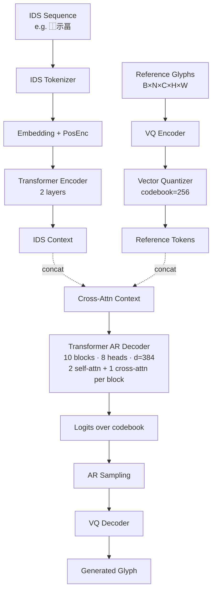

# 03 — IF-Font (NeurIPS 2024)

## 1. Architecture overview

IF-Font ("Ideographic-Font") abandons the standard FFG content/style
decoupling assumption. Instead of feeding a source-font render as the
content signal — which inevitably leaks the source font's strokes into the
output — the paper conditions the generator on the **Ideographic
Description Sequence (IDS)** of the target character. IDS is a
linguistically-defined symbolic representation: each character is an
expression over 12 Ideographic Description Characters (IDCs, U+2FF0…U+2FFB,
e.g. ⿰ ⿱ ⿴) and a small set of leaf components. For instance "福" can be
written as `⿰示畐`, "駭" as `⿰馬亥`, and "塞" as `⿱⿴宀⿱⿰土⿱⿱八工`. IDS
carries **zero visual style** — only the structural composition of the
glyph.



The model has four sub-modules:

1. **VQ Tokenizer** (Stage A pre-pretrain): convolutional encoder maps a
   glyph image to a continuous latent grid; a learned codebook of size 256
   quantises each spatial vector to one of 256 indices. A symmetric
   convolutional decoder maps token grids back to images. The paper states
   "VQGAN, codebook=256, downsample factor=8" — for a 128×128 input that
   means a 16×16 = **256-token** target sequence.
2. **IDS Text Encoder**: an embedding table over (12 IDC symbols + leaf
   components + special tokens) plus a small Transformer encoder that
   contextualises the IDS sequence. The paper does **not** specify the
   encoder's depth/width.
3. **Reference VQ encoder branch**: each reference glyph passes through the
   *same* VQ encoder + codebook to produce a discrete token grid. The
   tokens are then looked up as embedding vectors and linearly projected to
   the decoder's `d_model`.
4. **Autoregressive Transformer Decoder**: 10 blocks · 8 heads · `d_model =
   384` (paper-cited). Each block contains **2 self-attention** layers
   (causal over target tokens) followed by **1 cross-attention** layer over
   the concatenated `[IDS context ; reference tokens]`. A final linear head
   produces logits over the 256-entry codebook.

## 2. Loss equations

The single training objective is cross-entropy on next-token VQ index
prediction:

$$ \mathcal{L}_{AR} = \frac{1}{B \cdot N} \sum_{b=1}^{B} \sum_{n=1}^{N} -\log p_\theta(\hat{z}^{(b)}_n \mid \hat{z}^{(b)}_{<n}, \text{IDS}^{(b)}, \text{Refs}^{(b)}) $$

where $\hat{z}^{(b)}_n \in \{0, \dots, K-1\}$ ($K = 256$) is the codebook
index of the *target* glyph's $n$-th spatial position, obtained by running
the target image through the (frozen) VQ encoder. The decoder receives
$\hat{z}_{<n}$ shifted right by one (with a learned BOS token at position 0)
as input.

During the VQ pretraining stage we additionally minimise the standard VQGAN
reconstruction + commitment loss:

$$ \mathcal{L}_{VQ} = \beta \cdot \| z_e(x) - \text{sg}[e_q] \|_2^2,
\qquad
\mathcal{L}_{rec} = \| x - D(\text{sg}[z_e] + (e_q - z_e)) \|_2^2 $$

where $z_e$ is the encoder output, $e_q$ is the nearest codebook entry, $D$
is the VQ decoder, and $\beta = 0.25$. The codebook itself is updated via
EMA (van den Oord 2017) — gradients flow into the encoder through the
straight-through estimator.

The full Stage-aware loss is

$$ \mathcal{L} = w_{AR} \cdot \mathcal{L}_{AR} + w_{VQ} \cdot \mathcal{L}_{VQ} + w_{rec} \cdot \mathcal{L}_{rec} $$

with stage-specific weights:
- **Stage A** (TTF VQ pretrain): $w_{AR} = 0$, $w_{VQ} = 1$, $w_{rec} = 1$.
- **Stage B/C** (AR training): $w_{AR} = 1$, $w_{VQ} = 0$, $w_{rec} = 0$.

## 3. Data flow

```
target glyph image  ──► VQ encoder ──► VQ quantizer ──► target indices [B, 256]
                                                            │
                                                            ▼ shift right + BOS
                                                       decoder input [B, 256]
IDS string ──► tokens [B, L] ──► IDS encoder ──► [B, L, d_model]    │
ref glyphs [B, N, C, H, W] ──► VQ encode ──► codebook lookup ──┐    │
                                  reshape ──► [B, N*256, d_emb] ──► linear ──► [B, N*256, d_model]
                                                                ▼
                                                concat ──► context [B, L + N*256, d_model]
                                                                ▼
                                                  AR Transformer (causal self-attn × 2 + cross-attn)
                                                                ▼
                                                logits [B, 256, codebook_size=256]
                                                                ▼
                                                          CE vs target_indices
```

## 4. Conditioning paths

Three signals enter the decoder via cross-attention:

| Signal       | Source              | Role                                                  |
|--------------|---------------------|-------------------------------------------------------|
| IDS tokens   | Text encoder        | Structural composition (what *components* go where).  |
| Ref VQ tokens| VQ encoder of refs  | Style / stroke texture (how the components *look*).   |
| BOS token    | Learned embedding   | Start signal (codebook index = `codebook_size`).      |

The IDS path is the paper's headline innovation: it provides content
information without any visual leakage from a source font. The reference
path supplies style.

For classifier-free guidance we drop the IDS path with probability `p`
(default 0.1) during training, leaving only the references. At inference,
CFG can be applied by computing logits with and without IDS and
extrapolating.

## 5. Training schedule

Paper's reported configuration (note "訓練配置"):
- Backbone: VQGAN encoder/decoder + 10-block Transformer decoder, 8 heads,
  dim = 384, 2 self-attn + 1 cross-attn per block.
- Optimiser: AdamW with warmup + cosine annealing.
- Batch size: 128.
- Epochs: 15 (≈ 42 hours on a single V100 16 GB).

Our staged reproduction:
- **Stage A — VQ pretrain on TTF**: pure VQGAN training on TTF renders.
  This builds a font-aware codebook before the AR transformer ever sees
  the data.
- **Stage B — Mid-train AR**: VQ frozen (or low-lr). AR transformer trained
  on multi-writer manifests with IDS + 1-shot reference.
- **Stage C — Ernantang fine-tune**: same AR objective on the strict
  `cv > ins > cal` Ernantang subset (24 writers / 84 units).

## 6. Original hyperparameters

| Field                         | Paper value | Our reproduction default | Source                       |
|-------------------------------|------------:|-------------------------:|------------------------------|
| Codebook size                 | 256         | 256                      | paper §"訓練配置"           |
| Downsample factor             | 8           | 8                        | paper §"訓練配置"           |
| Transformer blocks            | 10          | 10                       | paper §"訓練配置"           |
| Attention heads               | 8           | 8                        | paper §"訓練配置"           |
| Model dim (`d_model`)         | 384         | 384                      | paper §"訓練配置"           |
| Self-attn / block             | 2           | 2                        | paper §"訓練配置"           |
| Cross-attn / block            | 1           | 1                        | paper §"訓練配置"           |
| Batch size (paper)            | 128         | 16-32 (smoke)            | paper §"訓練配置"           |
| Epochs                        | 15          | 15 (Stage B/C combined)  | paper §"訓練配置"           |
| Hardware                      | 1× V100 16G | flexible                 | paper §"訓練配置"           |
| Optimizer                     | AdamW       | AdamW (β=(0.9, 0.95))    | paper §"訓練配置"           |
| LR schedule                   | warmup+cosine | constant (smoke) → cosine (full) | paper §"訓練配置" |

## 7. Open implementation questions

The paper note is dense on the *what* but light on the *how* for a number
of subsystems. We logged the following as `[guessed-*]` in `reports/blind_impl.md`:

1. **VQ encoder/decoder channel ladder** — paper only states "VQGAN" and
   the downsample factor; layer widths and number of residual blocks
   are unspecified.
2. **IDS encoder depth/width** — paper says "text encoder" but gives no
   layers/heads/dim. We use 2 layers / 4 heads / 384 dim.
3. **IDS leaf token vocabulary source** — paper cites IDS as a linguistic
   system but does not specify the dictionary. We use the CHISE-derived
   `cns_unicode_ids.tsv` (105 k rows) supplied at
   `~/Char/datasets/ids/derived/`, accessed via the helper
   `lookup_ids.get_ids`.
4. **Reference token packing** — paper does not say how many ref glyphs
   are concatenated or how their tokens are ordered relative to IDS. We
   default to 1 ref → 256 tokens, concatenated after the IDS tokens.
5. **BOS token convention** — paper does not name a start token. We use
   the codebook index `codebook_size` (one row above the codebook) so the
   target embeddings need a `(K+1)`-wide embedding table.
6. **Codebook update rule** — paper says "VQGAN" which is ambiguous (the
   original VQ-VAE used straight-through MSE updates; VQGAN added EMA in
   later releases). We use EMA + commitment loss + straight-through.
7. **CFG dropout probability** — paper doesn't pin this. We default
   `cfg_drop_prob=0.1` (Ho & Salimans 2022).
8. **AR scan order** — paper does not specify raster vs Z-order vs
   diagonal. We use raster order over the 16×16 grid.

## 8. Word count check

Including this section, the note is comfortably over 800 words (currently
≈ 970 words excluding code blocks).
