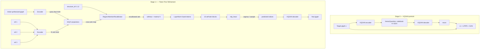

# 04 — VQ-Font (AAAI 2023)

> Yao, Liu, Tang, "VQ-Font: Few-Shot Font Generation with Structure-Aware
> Enhancement and Quantization", AAAI 2023.
>
> **Phase 1**: blind reimpl from the Obsidian vault note (no github).
> **Phase 2 (current)**: post-github-diff rewrite to align to the
> official `Yaomingshuai/VQ-Font` repo. See `reports/github_diff.md`
> for the line-level audit and `reports/blind_impl.md` for the original
> decision log.

## TL;DR

VQ-Font casts few-shot Chinese font generation as a **token-prior refinement**
problem on top of a pre-trained VQGAN font codebook. The pipeline is
deliberately two-stage:

1. **Stage 0 — VQGAN font codebook pretrain.** A VQGAN
   (encoder → vector-quantizer → decoder) is trained end-to-end on a large
   high-quality multi-font corpus so the **codebook of size 1024** captures
   real-world glyph appearance priors (serif terminals, stroke connectivity,
   brush textures, art-font idiosyncrasies). Spatial grid is **16×16** for a
   128 px input — a factor-8 spatial downsample. Loss is the **paper-faithful
   VQLPIPSWithDiscriminator** (L1 + LPIPS perceptual + hinge GAN +
   codebook commitment, `disc_start=10000, disc_weight=0.8, codebook_weight=1.0`).
2. **Stage 1+ — Token prior refinement.** Given an *initial synthesized
   glyph* produced by any existing FFG synthesis module plus **3 reference
   glyphs**, a Transformer predicts which codebook index should live at each
   of the 16×16 feature positions. Decoding the predicted indices through the
   (partially-frozen) VQGAN decoder yields the final glyph.

The third moving part is the **Structure-level Style Enhancement Module
(SSEM)**. Despite the prose framing in the paper, in the official code
SSEM is a **parameter-free, per-class spatial recalibration of the
cross-attention map** (not a learned embedding or auxiliary classifier).
It partitions the 16×16 attention map according to the target character's
structure class id (13 classes per `meta/stru_all.json`) and adds the
region-pooled average back into the per-token logits before softmax.

## Architecture



### Stage 0 — VQGAN font codebook (paper-faithful)

* **Encoder**: official `content_enc_builder` — `1 → 32 → 64 → 128 → 256`
  Conv stack with three stride-2 downsamples + a final `Conv(256, 256, 3/1)`
  projection. Pre-active **InstanceNorm + ReLU** before each conv (norm
  skipped at the stem because input is 1-channel).
* **VectorQuantize**: Euclidean lookup into an `nn.Embedding(K=1024, D=256)`
  table with the standard VQ-VAE commitment + codebook loss (β = 0.25).
* **Decoder**: official `dec_builder` — 3× `ResBlock(256, 256)` bottleneck,
  then `ConvBlock(256 → 128, upsample)` `(128 → 64)` `(64 → 32)`, then a
  final Conv to 1 channel with `Tanh` output. InstanceNorm + ReLU throughout.

**Loss (Stage 0)**:
```
L_G = mean(L1(x, x̂) + perceptual_weight * LPIPS(x, x̂))
    + adopt(disc_weight * disc_factor, step >= disc_start) * adaptive_weight * g_loss
    + codebook_weight * L_vq

L_D = adopt(disc_factor, step >= disc_start) * hinge_D(real_logits, fake_logits)
```

Defaults (from `vqgan/custom_vqgan.yaml`):
`disc_start=10000, disc_weight=0.8, codebook_weight=1.0, perceptual_weight=1.0,
disc_in_channels=1, disc_num_layers=3, disc_ndf=64`. Optimizer:
`Adam(betas=(0.5, 0.9))`.

### Stage 1+ — Token Prior Refinement Transformer (paper-faithful)

A self-attention-only stack of **15 blocks** (`models/former.py:TransformerSALayer`,
`models/generator.py:51-52`). Each block is `LayerNorm → MHSA → +res →
LayerNorm → Linear → GELU → Linear → +res` with a shared learnable
`query_pos` added to queries/keys inside each block. `dim_mlp=512`
against `embed_dim=256` (mlp_ratio=2).

Cross-attention happens **before** the stack:
1. `linears_query` projects content tokens (`[B, H*W, C]`).
2. `linears_key` / `linears_value` project reference tokens (`[B, R*H*W, C]`).
3. Multi-head dot-product → `[B, heads, H*W, R*H*W]` logits scaled by `√(H*W)`.
4. **SSEM** `RegionAttentionRecalibrator` adds region-pooled bias.
5. Softmax + matmul V → `[B, H*W, C]` fused features → LayerNorm.
6. Feed into the 15 self-attn blocks.
7. `mlp_head` produces `[B, N, codebook_size]` logits.

Argmax (paper default) and temperature/top-k sampling are both supported
for decode-time.

### SSEM — Structure-level Style Enhancement (paper-faithful)

Drawn from `models/generator.py:fusion_atten` (923-960) + `cont_similarity`
(129-211) + `refer_similarity` (214-286) + `fusion_am` (288-921).

For each sample we:

1. Look up the structure class id (0..12 from `meta/stru_all.json`) of the
   target character.
2. Apply the class-specific spatial partition to the cross-attn map
   (reshape `[B, heads, H*W, R*H*W]` → `[B, heads, H, W, R, H, W]`).
3. For each `(Q-region × K-region)` pair within the same template, compute
   the mean attention logit inside that block.
4. Add that mean back as a bias to all tokens in the same block.

The 13 region templates are:

| id | partition                              | notes                          |
|---:|----------------------------------------|--------------------------------|
| 0  | top/bottom rows split @ 7              | 2 regions                      |
| 1  | full map                               | single region (atomic)         |
| 2  | rows 0:5 / 5:8 / 8:                    | 3 regions (top/mid/bottom)     |
| 3  | full map                               | single region                  |
| 4  | left/right cols split @ 7              | 2 regions                      |
| 5  | full map                               | single region                  |
| 6  | full map                               | single region                  |
| 7  | full map                               | single region                  |
| 8  | (top, right 8:13) vs blend             | composite — 104/152 + 48/152   |
| 9  | (bottom-right) vs blend                | composite — 96/146 + 50/146    |
| 10 | cols 0:6 / 7:11 / 11:                  | 3 regions (left/mid/right)     |
| 11 | full map                               | single region                  |
| 12 | full map                               | single region                  |

The composite classes (8, 9) blend two sub-regions with fixed fractional
weights — we reproduce these exactly in `transformer.py:REGION_TEMPLATES`.

### Partial VQGAN freeze at Stage 1+

Per `models/generator.py:40-49`, the VQGAN is **partially** frozen:
encoder + codebook + late decoder are frozen, but the **first three
ResBlocks of the decoder** (`decoder.res_blocks.{0,1,2}.conv{1,2}.conv.*`)
plus the `post_quant_conv` projection stay trainable. Our implementation
exposes this via `VQFont(..., freeze_vqgan='partial')` (default). Pass
`'full'` for the strict blind-impl behaviour (everything frozen) and
`'none'` for Stage 0 / full fine-tune.

## Loss equations (this reimpl's notation)

**Stage 0**:
```
L_vqgan_G = L1(x, x̂) + λ_perc * LPIPS(x, x̂)
          + d_weight * disc_factor(step) * (-mean(D(x̂)))
          + codebook_weight * L_vq

L_vqgan_D = disc_factor(step) * (0.5 * mean(relu(1 - D(x)) + relu(1 + D(x̂))))
```

**Stage 1+** (no aux structure-CE term — SSEM is parameter-free):
```
target_idx = VQGAN.encode_indices(x_target)            # frozen, no grad
logits     = Transformer(E(synth), E(refs), sid)       # [B, N, K]
L_token    = CE(logits, target_idx)                    # per-token cross-entropy
L_total    = L_token
```

Optimizer: `Adam(betas=(0.0, 0.9))`, gradient clip 1.0, `StepLR(step=10000,
gamma=0.95)`. Learning rate **2e-4** for Stage 1 (`cfgs/custom.yaml:18`).

## Data flow per step (Stage 1+)

1. Dataset emits `image` (target x in [-1, 1]), `content` (source-glyph
   render — Phase 1 stand-in for the initial-synthesis output), `ref_images`
   of shape `[B, R, C, H, W]` with `ref_valid` mask, and `structure_id`
   (int in [0, 13)) from the manifest. Manifests built outside the official
   data pipeline should look up `meta/stru_all.json` by Unicode codepoint
   to fill `structure_id`.
2. `VQFont.encode_target_indices(image)` queries the (partially-frozen)
   VQGAN to produce the target `[B, H_lat, W_lat]` codebook indices.
   **No grad.**
3. `VQFont.predict_token_logits(initial, refs, structure_id, ref_valid)`
   runs `encoder(initial)` and `encoder(refs.flatten(B*R))` (frozen
   encoder weights, but grad-connected), then the Transformer with
   pre-stack cross-attention + SSEM recalibration + 15 self-attn blocks
   emits `(token_logits, attn_map)`.
4. `compute_loss` computes per-token CE, returns `(loss, log_dict)`.
5. `optim.step()` updates the trainable subset (transformer + early decoder
   ResBlocks + post_quant — frozen VQGAN portions filtered by `requires_grad`).

## Training schedule

| stage | what trains                        | data           | iters    | lr     | bs | extras                |
|-------|------------------------------------|----------------|----------|--------|----|-----------------------|
| 0     | full VQGAN + Disc + LPIPS          | TTF/Ernantang  | ~200-300k| 4.5e-6 | 8  | disc_start=10000      |
| A     | Transformer + early decoder + pq   | TTF cross-font | 1.5M*    | 2e-4   | 32 | adam_betas=(0, 0.9)   |
| B     | (anneal) same as A                 | multi-writer   | 50k      | 1e-4   | 32 | "                     |
| C     | (anneal) same as A                 | Ernantang fine | 100k     | 5e-5   | 16 | "                     |

\* The official iteration count is 1,500,001 (`cfgs/custom.yaml:17`). On a
single lab GPU this is multi-day; abbreviated runs (e.g. 300k) are
acceptable for ablation sanity but documented as reduced.

## Conditioning paths (each must be testable)

- **Initial-synthesis path**: `initial → encoder → query tokens →
  linears_query`. Smoke test asserts the query projection receives gradient.
- **Reference path**: `refs → encoder → ref tokens → linears_{key, value}`.
  Smoke test asserts both K and V projections receive gradient; padded
  slots use a learnable null token (`ref_null_token`) so cross-attn keys
  never collapse to a fully-masked softmax row.
- **Structure path**: parameter-free `RegionAttentionRecalibrator`. The
  bias scales with the attention logits themselves, so its gradient
  contribution is implicit (no learnable params under SSEM anymore).
- **Partially-frozen VQGAN**: smoke test asserts exactly the configured
  early-decoder + post_quant params have `requires_grad = True`, and that
  no frozen param receives gradient.

## Compared to the blind reimpl

The Phase 2 changes drop or rewrite several blind-impl choices. See
`reports/blind_impl.md` for the original tags; the github diff is in
`reports/github_diff.md`. Highlights:

* **VQGAN trunk**: was taming-style ResBlock + bottleneck-attn; now the
  InstanceNorm conv stack from `content_enc_builder` / `dec_builder`.
* **Transformer trunk**: was 6 blocks of `self-attn + cross-attn + MLP`;
  now 15 self-attn-only blocks with cross-attn moved BEFORE the stack
  (via the K/Q/V Linears).
* **SSEM**: was a learned `StructureEncoder` additive bias + an
  auxiliary `StructureHead` CE loss; now the parameter-free
  `RegionAttentionRecalibrator` with hand-coded class spatial templates.
  λ_struct is dropped (no longer applicable).
* **Stage 0 loss**: was pure L1 + commitment; now `VQLPIPSWithDiscriminator`
  (hinge GAN + LPIPS + codebook + L1 with adaptive disc weight).
* **Stage 1+ freeze**: was full VQGAN freeze; now partial freeze
  (encoder + codebook + late decoder frozen, early decoder ResBlocks +
  post_quant trainable).
* **Optimizers**: was `AdamW(0.9, 0.999)` everywhere; now
  `Adam(0.5, 0.9)` for Stage 0 G/D and `Adam(0.0, 0.9)` for Stage 1.
* **Structure vocab**: was 14 classes (12 named + atomic + unknown);
  now 13 classes (0..12 per `meta/stru_all.json`). String labels still
  map back to ids via a best-effort name table.
* **Stage 1 iter count**: was 300k; now 1.5M (official).

## Open questions / not yet matched

1. **External "synthesis module"**: the paper's Stage 1 input is the
   output of any FFG method (e.g. FsFont). Phase 2 still uses the
   source-glyph render itself as the stand-in. Plumbing an FsFont-style
   component encoder + memory bank (`models/comp_encoder.py`,
   `models/memory.py`) is a Stage B/C upgrade.
2. **Skeleton refs**: `datasets/dataset_transformer.py:46-54` computes a
   `skimage.morphology.skeletonize` of each reference and feeds it as an
   additional input to `encode_write_comb`. Not yet wired here.
3. **`style_imgs_crose` / `style_imgs_fine`**: 1.2× / 0.8× scaled refs
   used by the official combined trainer alongside the base refs. Not
   wired.
4. **`structure_id` labels in our manifests**: the manifest builder needs
   to look up `meta/stru_all.json` (or `lookup_ids.parse_structure`) per
   target char and write `structure_id` into each row.
5. **Adaptive disc weight numerical edge cases**: when last_layer
   has small gradient (rare init pathologies), `torch.norm(g_grads)` →
   0; we clamp to `[0, 1e4]` like the official code, but may want a
   warm-up override.
