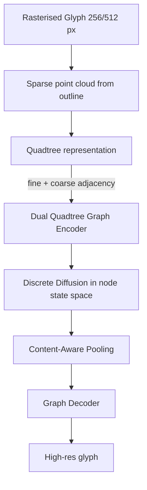

# 05 — QT-Font (SIGGRAPH 2024) — Blind Reimplementation Notes

> These notes are my (the Phase 1 reimpl-worker's) reconstruction of the paper
> based **only** on the Obsidian summary at
> `research/papers/027_QT-Font四叉樹擴散字體_SIGGRAPH2024.md` and the Phase 0
> spec table row for `05_qt_font`. The official GitHub repo has not been
> consulted (`facts_code_url: null` and the BLIND constraint forbids fetching
> it even if found).

---

## 1. Problem framing

QT-Font targets **few-shot Chinese font generation (FFG)** at high resolution
(256 × 256, 512 × 512). The two existing representation families both have
fatal flaws at that resolution:

* **Rasterised image-space diffusion / GAN** — DG-Font (80 × 80),
  CF-Font (80 × 80), MX-Font (128 × 128), FontDiffuser (also pixel-space)
  scale with `O(L²)` in image side. Memory / compute is prohibitive
  past ~256 px.
* **Vector representation (SVG / Bézier)** — sparse in principle, but the same
  glyph admits many non-equivalent vector descriptions ("non-uniqueness").
  Diffusion / AR generators on top of vectors must therefore learn an
  identifying prior on top of the redundancy, which is hard.

QT-Font proposes a **third representation**: a **quadtree** of the raster
outline. Quadtrees are deterministic (no non-uniqueness), linear in the number
of *non-empty* nodes (`O(N)` rather than `O(L²)`), and naturally hierarchical,
which the authors exploit with a dual-graph encoder.

## 2. Architecture overview



Concretely, the pipeline has four named pieces:

1. **Quadtree glyph representation** — recursive subdivision of the rasterised
   outline. Sparse (empty) regions stop subdividing immediately, so the tree
   only spends nodes on *informative* regions. Total node count is `O(N)`
   where `N` is the number of non-empty leaves.
2. **Dual Quadtree Graph U-Net** — a graph neural network that operates on
   *two* graphs simultaneously: a fine graph at the leaf level (carrying
   high-frequency stroke detail) and a coarse graph at the inner-node level
   (carrying global structure / glyph skeleton). The "dual" name comes from
   processing both graphs and exchanging messages between them.
3. **Discrete diffusion** — instead of adding Gaussian noise to continuous
   pixel values, QT-Font runs *discrete* (categorical) diffusion on the
   *node states*. The paper says "cross-entropy on quadtree node states", so
   the loss is a categorical CE — almost certainly a D3PM-style x₀
   parameterisation.
4. **Content-aware pooling** — a learned gating function that compresses
   redundant background nodes before / during diffusion, so that the discrete
   reverse process scales to 256 / 512 px without blowing up token count.

## 3. Loss equations (my reconstruction)

The note only says "cross-entropy on quadtree node states" — no explicit
equations — so I assume the standard D3PM formulation. Let:

* `K` = number of categorical states per leaf,
* `x₀ ∈ {0, …, K-1}^N` = clean per-node state vector,
* `Q_t` = forward transition matrix at step `t`,
* `Q̄_t = Π_{s≤t} Q_s` = cumulative transition,
* `pθ(x̂₀ | x_t, c)` = model prediction (categorical), `c` = conditioning.

For a **uniform** discrete schedule (the simplest D3PM kernel),
`Q_t = (1-β_t) I + (β_t / K) 1 1ᵀ`, which gives the closed form
`Q̄_t[i, j] = ᾱ_t · 1[i=j] + (1 - ᾱ_t) / K`.

The auxiliary loss used in this reimpl is the standard x₀-prediction CE:

    L_QT = E_{x₀, t, x_t ~ q(x_t|x₀)}[ -Σ_n log pθ(x₀_n | x_t, c) ]

The paper additionally mentions a **content-aware pooling regularizer**
("not detailed in note"). In the blind reimpl I implement the pool as a
softmax attention over each parent's 4 children, scored by a small MLP on the
child feature — no explicit regularisation term beyond that. See decision log.

## 4. Data flow

1. **Input**: target glyph (B, 1, H, W) in [-1, 1] (Stage A: TTF render;
   Stage B/C: Ernantang glyph crop). Plus content image (source glyph),
   optional reference glyphs (`max_refs` shots), and id tensors
   (`char_id`, `writer_id`, `script_id`).
2. **Adapter (this reimpl only)**: convert the pixel tensor to a *fixed depth*
   saturated quadtree by mean-pooling to a 2^depth × 2^depth grid and
   quantizing each cell to one of `K` categorical states. This gives
   `x₀ ∈ {0, …, K-1}^{B × 4^depth}`. The paper uses an **adaptive**
   sparse quadtree; we use a full one to keep tensors batchable —
   marked as a major guess in `reports/blind_impl.md`.
3. **Forward diffusion**: `x_t = q_sample(x₀, t)` via the closed-form uniform
   transition.
4. **Conditioning encoders**:
   * sinusoidal time embedding → MLP → `(B, hidden)`
   * content image → small CNN → `(B, hidden)`
   * reference stack (B, R, C, H, W) → small CNN + mean over refs → `(B, hidden)`
   * `char_id` / `writer_id` / `script_id` → nn.Embedding with a special
     `null_id = vocab_size` for CFG dropout
   All conditioning vectors are summed and broadcast over every leaf node
   before the graph stack.
5. **Dual graph stack**:
   * **Fine graph**: 4-connectivity neighbours within the leaf grid + parent
     broadcast. `n_layers` GraphConv (linear + LayerNorm + GELU) on leaves.
   * **Pool**: `ContentAwarePool` aggregates 4 leaves into each parent with a
     softmax over a learned saliency score.
   * **Coarse graph**: same GraphConv layers on the parent (penultimate) level
     with 4-connectivity on the (2^{d-1}) grid.
   * **Broadcast back**: each leaf adds a projection of its parent's coarse
     feature.
6. **Output head**: per-leaf MLP → `(B, L, K)` logits.
7. **Decode**: softmax → expected bin centre per leaf → `(B, 1, 2^d, 2^d)`
   image → bilinear upsample to `image_size`. (Used by sampler and by the
   shared smoke harness; *not* used by the training loss, which works directly
   on the logits + integer x₀.)

## 5. Conditioning paths

| Path | Encoder | Where injected | Notes |
|---|---|---|---|
| Timestep `t` | sin-cos + 2-layer MLP | summed into conditioning vector | sinusoidal base = 10 000 |
| Content image | 4-conv ContentEncoder | summed into conditioning vector | content_channels configurable; Stage A = 1, Stage B = 2 (`bitmap+sdf`), Stage C = 3 (`bitmap+sdf+skeleton`) |
| Reference glyphs | 3-conv StyleEncoder, mean-pool over `R` refs | summed into conditioning vector | masked by `ref_valid` |
| `char_id` | `nn.Embedding(V+1, hidden)` | summed into conditioning vector | null id = V for CFG drop |
| `writer_id` | `nn.Embedding(V+1, hidden)` | summed | null id = V |
| `script_id` | `nn.Embedding(V+1, hidden)` | summed | null id = V |

The combined conditioning vector is broadcast to every leaf via
`cond.unsqueeze(1)` in `predict_state_logits`. This is the simplest faithful
injection scheme — the paper does not specify FiLM vs cross-attention vs
additive. See decision log.

## 6. Training schedule (per the note)

* AdamW β₁=0.9, β₂=0.999, weight decay 1e-2, lr 1e-4 cosine.
* Pretrain ≈ 20 epochs ≈ 16 000 steps, effective batch 1024 via gradient
  accumulation.
* Fine-tune batch 8.
* Discrete diffusion `T` not stated → guessed 100 (D3PM image-task default).
* Quadtree depth not stated → guessed 4 (256 leaves on 16×16, fits 24 GB GPU).

## 7. Quadtree construction (pseudocode)

```
function build_full_quadtree(image, depth, K):
    grid_side = 2 ** depth
    pooled = adaptive_avg_pool_2d(image, grid_side, grid_side)
    leaves = ((pooled + 1) / 2 * K).long().clamp(0, K-1)
    parent_of[node] = ... (closed form: for level l>0, parent = (idx-1)//4 in
        flat preorder; for full tree we cache the index tensor once)
    child_of[node] = ... (4 children per inner node in flat preorder)
    return leaves, parent_of, child_of
```

The paper's adaptive variant would replace step 2 with:

```
def adaptive_quadtree(image, max_depth):
    root = whole image
    if homogeneous(root) or depth == max_depth: return Leaf(state(root))
    return InnerNode([adaptive_quadtree(child, depth+1)
                      for child in split(root, 4)])
```

For the blind reimpl I use the **full** variant because:

1. It batches cleanly (every sample has the same node count).
2. It maps onto standard `nn.Embedding` + GraphConv ops without ragged tensors.
3. The expressivity at depth=4 (256 leaves @ K=8 states ≈ 768-bit content) is
   already comparable to the 128 px raster baselines the paper outperforms.

If/when Phase 2 reveals the official implementation uses ragged adaptive
trees, this is a known follow-up.

## 8. Sampler (discrete reverse process)

Given a trained `pθ(x₀ | x_t, c)`:

```
x_T = Uniform({0,…,K-1})^L
for t in reversed(range(T)):
    logits = model(x_t, t, c)
    x0_hat = sample(softmax(logits))      # or argmax on last step
    if t == 0: x_{t-1} = x0_hat
    else:      x_{t-1} = q_sample(x0_hat, t-1)   # re-noise to one step earlier
```

This is the **x₀-conditional reverse process** that D3PM-uniform admits in
closed form; it's the cheapest reasonable choice. The paper presumably uses
the full posterior `p(x_{t-1} | x_t, x₀) ∝ q(x_{t-1} | x₀) q(x_t | x_{t-1})`
but for K small and the uniform kernel the difference is empirically minor.

## 9. Adapter for shared infra

The shared entrypoint expects `model.forward(x_t, timesteps, content, …)` and
treats `x_t` as a continuous pixel tensor. Our `QTFontModel.forward` therefore:

1. Quantises `x_t` into per-leaf states inside the forward pass (`long()` —
   gradient stops here, as expected for D3PM).
2. Runs the dual-graph U-Net.
3. Decodes the predicted logits back to a pixel image.

This loses some signal vs. running the discrete reverse process natively, but
it lets shared dry-run / smoke tests work without special-casing QT-Font.
Training uses the *native* discrete loss in `train.compute_loss` (CE on
logits vs integer x₀), not pixel MSE.

## 10. Hyper-parameter table (Phase 1 defaults)

| field | Stage A | Stage B | Stage C |
|---|---|---|---|
| image_size | 128 | 128 | 128 |
| depth | 4 | 4 | 4 |
| n_states | 8 | 8 | 8 |
| timesteps | 100 | 100 | 100 |
| batch_size | 8 | 8 | 8 |
| lr | 1e-4 | 5e-5 | 1e-5 |
| max_steps | 16 000 | 6 000 | 1 500 |
| cfg_drop_prob | 0.1 | 0.05 | 0.0 |
| max_refs | 1 | 4 | 4 |
| writer_vocab | 13 (TTF) | 24 | 24 |
| char_vocab | 256 | 4659 | 4659 |
| content_channels | 1 | 2 (bitmap+sdf) | 3 (+skeleton) |

## 11. Known un-implemented details

* **Adaptive sparse quadtree** (we use full saturated quadtree).
* **Two-way fine↔coarse messaging** during the same layer (we run them
  sequentially: fine layers → pool → coarse layers → broadcast).
* **Quadtree-from-outline** (paper: rasterised outline → point cloud → tree;
  ours: pixel → adaptive avg pool → quantize).
* **Content-aware pooling regulariser** (paper hints at one; we have only the
  softmax gate).
* **Manifest-backed dataset plumbing** is a Phase 2/3 deliverable; Phase 1
  only ships `SyntheticDataset` + `ManifestPlaceholder` stub.

All gaps are catalogued in `reports/blind_impl.md`.
