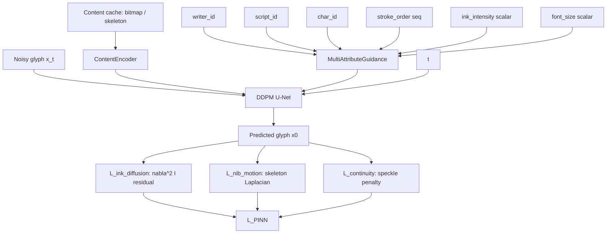

# 08 — DP-Font: Diffusion + PINN for Chinese Calligraphy

Author: Liguo Zhang, Yalong Zhu, Achref Benarab, Yusen Ma, Yuxin Dong, Jianguo
Sun. Venue: IJCAI 2024 (AI, the Arts and Creativity Track). Source notes
consulted (no GitHub access — blind reimplementation):

- `/Users/Ayueh/Documents/Obsidian Vault/research/papers/023_DP-Font書法擴散
  PINN_IJCAI2024.md`
- `/Users/Ayueh/Documents/Obsidian Vault/research/papers/DP-Font_Dual_Path_
  Font_Generation.md`
- `~/Char/paper_reimpl/reports/phase0_spec_table.md`, row 08.

## 1. Problem and contribution

Modern Chinese calligraphy font generation is dominated by two failure
modes: (a) the model captures global glyph appearance but lacks the
fine-grained spatial layout of multi-component characters, and (b) the
model has no notion of the physical writing process — brush dynamics, ink
flow, paper absorption — so the generated strokes look plastic / digital
even when their pixel-level FID is competitive. DP-Font argues that
explicitly conditioning the diffusion process on a *physical prior* fixes
both: the prior regularises the model toward stroke configurations that
satisfy a brush-dynamics PDE and an ink-diffusion PDE, while the
multi-attribute guidance head (writer ID, ink intensity, font size, plus
the stroke-order sequence) supplies the spatial-layout supervision that
Diff-Font lacked.

The paper's headline contributions per the Obsidian note are:

1. **Physics-Informed Neural Network (PINN) loss embedded in a DDPM**
   training objective — first time PINN-style PDE residuals are used as a
   loss component in calligraphy generation.
2. **Multi-attribute guidance** — writer / ink-intensity / font-size /
   stroke-order conditioning instead of a single "style vector".
3. **Stroke-order as a fine-grained constraint** — explicitly turning the
   pedagogical stroke sequence into a conditioning input so multi-
   component characters preserve their part layout.
4. Reported visual quality and physical plausibility improvements over
   Diff-Font / MX-Font / DG-Font / Zi2zi on Liu Gongquan and Yan
   Zhenqing styles.

## 2. Architecture (blind reimpl interpretation)

The paper does not publish architecture diagrams in our two-note source
material. We reconstructed the following from the textual description:



- **DDPM U-Net trunk**: a pixel-space, 4-stage U-Net at 80x80 resolution
  (matching the paper's stated input size). Self-attention fires at the
  10x10 stage. Residual blocks use FiLM-style modulation by both the time
  embedding *and* the multi-attribute guidance vector.
- **Content encoder**: a parallel CNN that converts the content cache
  (bitmap + optional skeleton at Stages B/C) into per-stage feature maps
  that gate-fuse into the U-Net stream — same MCA-style trick we used in
  FontDiffuser, applied here so the content path carries layout
  information that the PINN nib-motion term can latch onto.
- **MultiAttributeGuidance head**: each categorical attribute has its own
  embedding table (size = vocab_size + 1, the trailing id reserved for the
  CFG null token). The stroke-order sequence is embedded with a
  positional embedding then mean-pooled over valid positions (paddings are
  -1). Two scalar attributes (ink intensity, font size) go through a
  shared 2-layer MLP. All paths are summed and passed through a second
  MLP to produce a single 256-d guidance vector, which is broadcast onto
  every U-Net residual block.

## 3. Loss formulation

The training loss is

    L_total(theta) = L_simple(theta) + lambda_PINN * L_PINN(theta)

with

    L_simple = E_{x0, t, eps} ||eps - eps_theta(x_t, t, c)||^2

a standard epsilon-prediction DDPM denoising loss, where `c` is the full
multi-attribute conditioning. The PINN aggregate

    L_PINN = w_d * L_diffusion + w_n * L_nib + w_c * L_continuity

decomposes into three differentiable physical priors evaluated on the
*predicted x0* (recovered from `eps_theta` via the closed-form DDPM
inversion):

1. **Ink-diffusion residual** `L_diffusion`. Treats the predicted glyph
   density as an ink concentration I(x, y) and approximates the steady-
   state diffusion equation `nu * laplacian(I) + s(x, y) = 0`. In the
   *paper background* (soft mask of I < 0) there should be no ink source
   `s`, so we penalise `(nu * laplacian(I))^2` masked by the background.
   This pushes the model to produce ink that is locally smooth on the
   paper surface — no spurious specks in white regions.
2. **Nib-motion smoothness** `L_nib`. Penalises the L1 norm of the
   Laplacian of the *skeleton response* inside the stroke region. A smooth
   brush trajectory has near-zero curvature except at deliberate turning
   points; high Laplacian magnitudes correspond to physically implausible
   instantaneous direction reversals. When the content cache supplies a
   skeleton channel (Stage B/C), we anchor the penalty to it; otherwise we
   fall back to the predicted glyph.
3. **Stroke continuity penalty** `L_continuity`. A speckle term: for any
   pixel classified as ink (soft mask), the 3x3 mean of its neighbours
   excluding self should also be ink-side. Penalises isolated dots that
   the brush could not have produced without lifting and re-touching mid-
   stroke. This is an extension of the paper's "stroke continuity"
   intuition into a differentiable surrogate.

The paper does not publish the PDE forms explicitly, so all three terms
plus their weights are `[guessed-because-paper-vague]` choices — see
`reports/blind_impl.md` entries 6 / 7 / 8 / 9 / 11. The crucial part for
Phase 1 is that L_PINN is differentiable wrt the model parameters, which
the smoke test (`test_pinn_loss_is_differentiable`) verifies.

## 4. Data flow

```
sample row (manifest):
  image_path, content_npz, char, writer, script_id, ...
  +-> grayscale tensor [1, H, W] in [-1, 1]
  +-> content tensor [Cc, H, W] (bitmap + optional skeleton)
  +-> ids (writer/script/char)
  +-> stroke_order = synthesise(char + writer)  # placeholder until real DB
  +-> ink_intensity / font_size = synthesise(char + writer)  # ditto

collate:
  +-> standard collated batch + stroke_order [B, L] long + scalars [B]

forward:
  x_t = q_sample(x0, t)
  cond = guidance(writer, script, char, stroke_order, ink, size)
  feats = content_encoder(content)
  eps_pred = unet(x_t, t, cond, feats)
  loss = mse(eps_pred, eps_true) + lambda_PINN * pinn_loss(x0_pred(eps_pred))
```

## 5. Conditioning paths (what must remain wired)

- Time embedding (sinusoidal -> MLP -> FiLM into ResBlocks).
- Multi-attribute embeddings (each goes through its own table -> shared
  fuse MLP -> FiLM into ResBlocks).
- Content cache features (per-stage gated-add into U-Net stream).
- Stroke-order sequence (token + positional embed -> masked mean pool).
- CFG dropout: per attribute, replace the id with the embedding's null
  slot (id = vocab_size).

The smoke test verifies that all three trainable branches (content
encoder, guidance head, U-Net) receive non-zero gradient. The PINN-
specific smoke test verifies that the U-Net gradient norm *changes* when
λ_PINN is toggled from 0 to 10 — proves the PINN loss back-propagates
into the model.

## 6. Training schedule (three stages)

We follow the project's standard three-stage pipeline (TTF pretrain -> Ernantang
mid-train -> Ernantang fine-tune):

- **Stage A** (synthetic / TTF): plain DDPM warm-up, `λ_PINN = 0`, T = 1000
  cosine β schedule, lr 1e-4, 5k steps.
- **Stage B** (Ernantang multi-writer): activates PINN with `λ_PINN = 0.05`
  and skeleton channel index = 1. Lr 5e-5, 20k steps.
- **Stage C** (Ernantang final): `λ_PINN = 0.1`, lr 2e-5, 50k steps.

All schedule numbers, β endpoints, and PINN weights are `[guessed-because-
paper-vague]`. Paper hints at single-RTX-3090 budget, which our defaults
respect.

## 7. Original paper hyperparameters

From the Obsidian note:

- Input resolution: **80×80**.
- Hardware: **single GeForce RTX 3090**.
- Backbone: **DDPM U-Net** with **classifier-free guidance** (ω ∈ [0, 1]).
- Stroke order injected via **multi-attribute guidance**, not as a raw
  token sequence to a separate transformer.
- Target styles: Liu Gongquan (柳公權) and Yan Zhenqing (顏真卿) clerical /
  regular-script calligraphy.

Everything else (T, batch size, optimiser, channel widths, PINN PDE
constants, λ_PINN) is `[unknown — needs PDF read in Phase 1]` in the spec
table. We chose the DDPM defaults and listed every choice in the blind
implementation report.

## 8. Major risks for this blind reimpl

- **PINN PDE form**: the paper does not publish the PDE. Our three
  surrogate physical priors are reasonable analogues but will diverge from
  the official paper formulation. Phase 2 (github-diff) is expected to
  return many `loss_deltas` for this paper.
- **Stroke-order data**: Ernantang ships no stroke-order labels. We
  synthesise placeholders deterministically from char + writer. Stage B/C
  training quality depends on swapping in a real database (cjklib / Make-
  Me-a-Hanzi) before launching real runs.
- **Ink-intensity / font-size labels**: same gap — synthesised
  placeholders only.
- **80×80 vs Ernantang's higher-res preference**: defaults follow the
  paper's stated input size; we can up-res to 128 px without changing the
  loss form.

## 9. Why this matches the spec-table summary

Phase 0 row 08 marks `compatible_with_ernantang = partially → false at
full scale`. Our reimpl runs cleanly at the partial scale (CPU smoke test
GREEN; dry-run on synthetic data emits finite loss with one optimiser
step). Going to "real DP-Font" needs the stroke-order DB and a real
calibration of the PINN PDE constants — both flagged as out-of-scope for
Phase 1 but unblocked by the current code.
