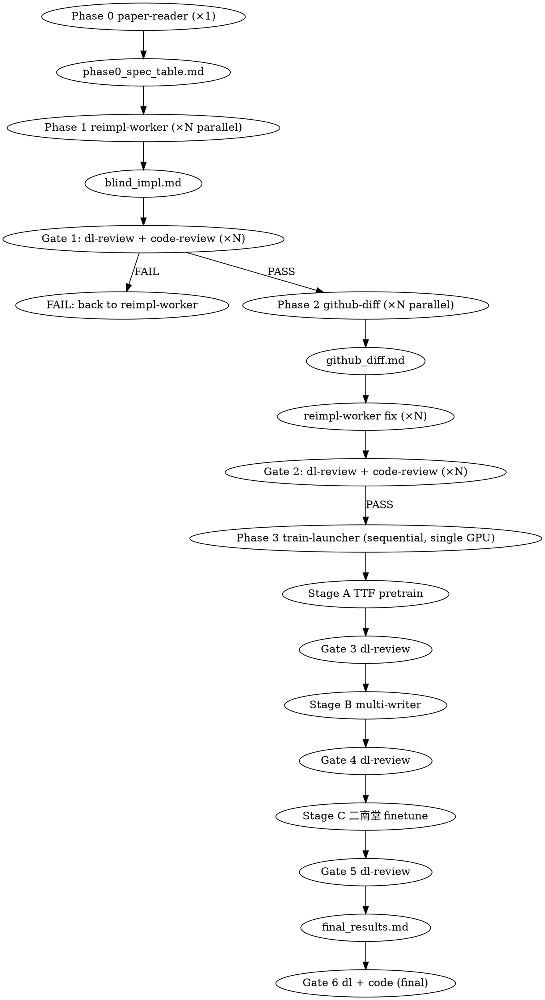

# Paper-Reimpl Pipeline Skill

Implements 二南堂 sister-repo `paper_reimpl` workflow for blind reimplementing
N diffusion-based generation papers, comparing against official github,
and training on 3-stage data curriculum (TTF → multi-writer calligraphy → 二南堂).

## When to invoke

- "重現 XX paper"
- "blind reimplement 這篇"
- "對比我們和 official"
- "把 N 篇 paper 都做一遍 baseline"
- User invokes `/paper-reimpl-pipeline`

**Not for**: one-off code reading; trivial reproduction; paper survey only.

## Workflow

## Mandatory checklists

### Phase 0 entry
- [ ] N paper notes available (Obsidian or PDFs)
- [ ] sister repo skeleton exists (this repo)
- [ ] mother_repo_link symlink valid

### Phase 1 entry per paper
- [ ] paper's `pyproject.toml` lists known deps
- [ ] `uv sync` succeeds
- [ ] `tests/test_smoke.py` stub exists
- [ ] `paper_notes/<NN>.md` populated by Phase 0

### Phase 1 → 2 gate
- [ ] DL reviewer returns PASS or PASS-WITH-NITS
- [ ] Code reviewer returns PASS or PASS-WITH-NITS
- [ ] `uv run pytest tests/test_smoke.py -x` green
- [ ] `uv run python -m paper_reimpl_shared.runner.entrypoint --paper X --dry-run --synthetic --device cpu ...` passes
- [ ] `reports/blind_impl.md` has ≥5 `[guessed-...]` entries

### Phase 2 → 3 gate
- [ ] `reports/github_diff.md` exists (or marked `official_unavailable`)
- [ ] reimpl-worker addressed P0/P1 diff items
- [ ] DL + Code reviewer re-PASS

### Stage A/B/C entry
- [ ] `nvidia-smi` shows cuda:0 free or specified GPU free
- [ ] ckpt_dir + log path reserved
- [ ] bat script emitted via `paper_reimpl_shared.runner.launcher_lab.emit_bat()`

### Stage A/B/C exit
- [ ] No NaN in last 1k steps (grep log)
- [ ] Loss curve descends or stabilizes
- [ ] sample grid PNG generated
- [ ] DL reviewer signs `dl_review_stage_<x>.md`

### Final gate
- [ ] All 3 stages PASS
- [ ] `final_results.md` includes A3.15-vs-this-paper comparison grid
- [ ] full repo `uv run ruff check` PASS
- [ ] no SSH credentials committed (`grep` check)

## Templates

In `templates/`:
- `paper_reader_prompt.md` — Phase 0 agent prompt skeleton
- `reimpl_worker_prompt.md` — Phase 1 agent prompt skeleton (blind impl)
- `dl_review_prompt.md` — DL reviewer prompt
- `code_review_prompt.md` — Code reviewer adapter to `everything-claude-code:python-review`
- `github_diff_prompt.md` — Phase 2 agent prompt
- `train_launcher_prompt.md` — Phase 3 agent prompt
- `blind_impl_template.md` — output template for Phase 1 worker
- `stage_results_template.md` — Stage A/B/C reports template
- `final_results_template.md` — final per-paper report

## Backend abstraction

Code in this skill assumes `paper_reimpl_shared.data.manifest.Backend` resolves
correctly for `mac_symlink / lab_server / vast_snapshot`. Adding a new
backend (e.g. RunPod, Modal): write a new entry in `BackendPaths.resolve()`,
add docs to `docs/<NEW>_BACKEND.md`. No per-paper code change needed.

## Use of other skills

- `superpowers:dispatching-parallel-agents` for Phase 1 / 2 fanout
- `superpowers:subagent-driven-development` for the per-phase agent execution
- `superpowers:brainstorming` inside each reimpl-worker before coding
- `superpowers:verification-before-completion` at every gate
- `everything-claude-code:python-review` for code review at every gate
- `pc-gpu-training` skill **NOT used** here — different machine (lab server)
